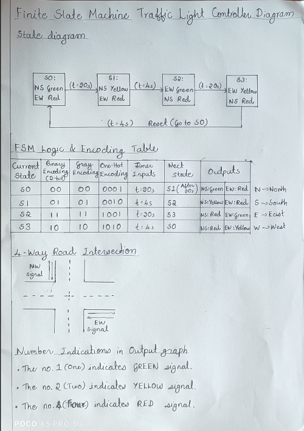

# FSM-Traffic-Light-Controller-using-SV
This project models an automated road intersection controlling North-South (NS) and East-West (EW) traffic dynamics. The design utilizes SystemVerilog constructs like enum, multi-dimensional arrays, and parameterized timing modules to create clean, scalable RTL code.
This repository contains the Verilog design and testbench for a Traffic Light Controller, along with its architectural layout and simulation waveforms.

---

## 🛠️ Architecture
Below is the architectural block diagram of the design:



---

## 💻 Design Code
You can find the source file [here](./traffic_light_controller.sv). To copy the code quickly, use the block below:

```systemverilog
// 1. DESIGN CODE GOES HERE
module traffic_light_controller (
    input  logic clk,           // System Clock
    input  logic reset,         // Active-high Reset
    output logic [2:0] lights_ns, // North-South Lights: [2]=Red, [1]=Yellow, [0]=Green
    output logic [2:0] lights_ew  // East-West Lights:   [2]=Red, [1]=Yellow, [0]=Green
);

    // 1. Define State Encodings (Using Sequential Binary Encoding)
    typedef enum logic [1:0] {
        S0_NSG_EWR = 2'b00, // North-South Green, East-West Red
        S1_NSY_EWR = 2'b01, // North-South Yellow, East-West Red
        S2_NSR_EWG = 2'b10, // North-South Red, East-West Green
        S3_NSR_EWY = 2'b11  // North-South Red, East-West Yellow
    } state_t;

    state_t current_state, next_state;

    // 2. Define Timing Parameters (Number of clock cycles per state)
    localparam int unsigned TIME_GREEN  = 10;
    localparam int unsigned TIME_YELLOW = 3;

    // Internal clock cycle counter
    int unsigned count;

    // --- BLOCK 1: Sequential State Register ---
    always_ff @(posedge clk or posedge reset) begin
        if (reset) begin
            current_state <= S0_NSG_EWR;
            count         <= 0;
        end else begin
            current_state <= next_state;
            
            // Increment counter, reset it to 0 when transitioning states
            if (current_state != next_state)
                count <= 0;
            else
                count <= count + 1;
        end
    end

    // --- BLOCK 2: Combinational Next-State Logic ---
    always_comb begin
        // Default assignment to avoid latches
        next_state = current_state; 

        case (current_state)
            S0_NSG_EWR: begin
                if (count >= (TIME_GREEN - 1))
                    next_state = S1_NSY_EWR;
            end
            
            S1_NSY_EWR: begin
                if (count >= (TIME_YELLOW - 1))
                    next_state = S2_NSR_EWG;
            end
            
            S2_NSR_EWG: begin
                if (count >= (TIME_GREEN - 1))
                    next_state = S3_NSR_EWY;
            end
            
            S3_NSR_EWY: begin
                if (count >= (TIME_YELLOW - 1))
                    next_state = S0_NSG_EWR;
            end
            
            default: next_state = S0_NSG_EWR;
        endcase
    end

    // --- BLOCK 3: Combinational Output Logic ---
    // Mapping: Bit 2 = Red, Bit 1 = Yellow, Bit 0 = Green (3'bR_Y_G)
    always_comb begin
        case (current_state)
            S0_NSG_EWR: begin lights_ns = 3'b001; lights_ew = 3'b100; end // NS Green, EW Red
            S1_NSY_EWR: begin lights_ns = 3'b010; lights_ew = 3'b100; end // NS Yellow, EW Red
            S2_NSR_EWG: begin lights_ns = 3'b100; lights_ew = 3'b001; end // NS Red, EW Green
            S3_NSR_EWY: begin lights_ns = 3'b100; lights_ew = 3'b010; end // NS Red, EW Yellow
            default:    begin lights_ns = 3'b100; lights_ew = 3'b100; end // Default All Red
        endcase
    end

endmodule
endcase

// 2.TESTBENCH CODE GOES HERE
`timescale 1ns/1ps

module testbench;
    // Inputs to the UUT (Unit Under Test)
    logic clk;
    logic reset;

    // Outputs from the UUT
    logic [2:0] lights_ns;
    logic [2:0] lights_ew;

    // Instantiate the Unit Under Test (UUT)
    traffic_light_controller uut (
        .clk(clk),
        .reset(reset),
        .lights_ns(lights_ns),
        .lights_ew(lights_ew)
    );

    // 1. Generate standard clock signal (Period = 10ns -> Toggle every 5ns)
    always begin
        #5 clk = ~clk;
    end

    // 2. Test Sequence
    initial begin
        // Setup waveform dumping for EDA Playground EPWave viewer
        $dumpfile("dump.vcd");
        $dumpvars(0, testbench);

        // Initialize signals
        clk = 0;
        reset = 1;

        // Hold reset active for 20ns
        #20;
        reset = 0;

        // Run the simulation long enough to watch multiple full cycles 
        // 1 cycle = Green(10) + Yellow(3) + Green(10) + Yellow(3) = 26 cycles * 10ns = 260ns
        #350;

        // End simulation
        $display("Simulation finished successfully.");
        $finish;
    end
endmodule
